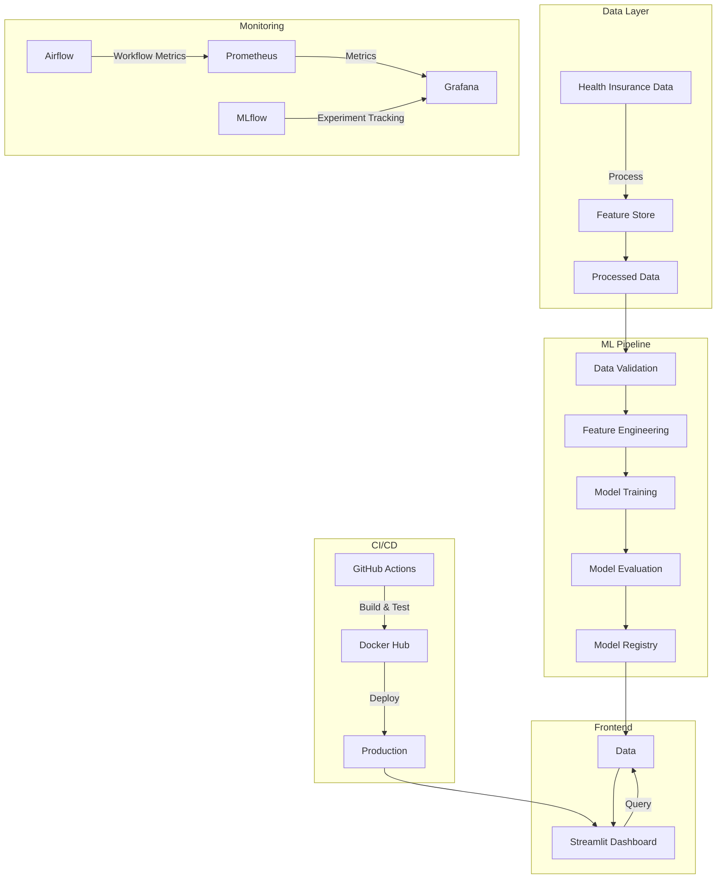

# ForensicOps: Forensic Auditing for Health Insurance 

[](https://www.python.org/)
[](https://opensource.org/licenses/MIT)
[](https://github.com/psf/black)
[](https://github.com/HarshiniAiyyer/ForensicOps/actions)
[](https://forensicops.readthedocs.io/en/latest/?badge=latest)
[](https://codecov.io/gh/HarshiniAiyyer/ForensicOps)
[](https://hub.docker.com/r/harshiniaiyyer/forensicops)
[](https://github.com/HarshiniAiyyer/ForensicOps/stargazers)

<div align="center">
  
</div>


An end-to-end MLOps solution for detecting financial anomalies in health insurance claims using Benford's Law and machine learning.

## 🎯 Core Objective and Project Overview
- This MLOps project implements a forensic audit system for healthcare insurance coverage data under the Affordable Care Act (ACA). The system combines statistical analysis (Benford's Law) and ML techniques to detect potential anomalies and patterns in healthcare enrollment data across US states. 

- By analyzing changes in insurance coverage rates, enrollment numbers, and program participation before and after the ACA implementation, the project helps identify potential irregularities and provides insights into the effectiveness of healthcare reforms.

- This project implements a Machine Learning Operations (MLOps) pipeline for financial data analysis and model training.Detect financial anomalies and potential fraud in health insurance claims by combining statistical analysis (Benford's Law) with machine learning techniques.

## 📐 System Architecture



## 🛠️ Technical Stack

### Core Technologies
- **Backend**: Python 3.9+
- **Machine Learning**: scikit-learn, XGBoost
- **Dashboard**: Streamlit
- **Workflow Orchestration**: Apache Airflow
- **Data Versioning**: DVC
- **Experiment Tracking**: MLflow
- **Containerization**: Docker
- **Monitoring**: Prometheus, Grafana

### CI/CD Pipeline
- **GitHub Actions** for automated testing and deployment
- **Docker** for containerization
- **DockerHub** for container registry

## 🚀 Features

### 1. Data Analysis with Benford's Law
- Implements Benford's Law to analyze leading digit distribution
- Identifies anomalies in financial data patterns
- Focused on health insurance metrics

### 2. Machine Learning Pipeline
- Multiple ML models for anomaly detection:
  - Logistic Regression
  - Support Vector Machines (SVC)
  - K-Nearest Neighbors (KNN)
  - Decision Trees
  - Random Forest
  - AdaBoost
  - Naive Bayes
  - Neural Networks (MLP)
  - XGBoost
- Comprehensive data preprocessing and model evaluation

### 3. Interactive Web Dashboard
- Real-time data visualization
- Model training and evaluation interface
- Interactive data exploration
- Direct data loading from GitHub

### 4. MLOps Infrastructure
- **Airflow**: Scheduled model training and data processing
- **DVC**: Data and model versioning
- **MLflow**: Experiment tracking and model registry
- **Docker**: Containerized deployment
- **Prometheus**: System and model monitoring

## 🛠️ CI/CD Pipeline

### Workflow Overview
1. **Linting and Testing**
   - Python code linting with Flake8
   - Unit and integration testing with pytest
   - Code quality checks

2. **Docker Image Build and Push**
   - Builds Docker container with the application
   - Pushes to DockerHub with both `latest` and commit SHA tags
   - Utilizes Docker Buildx for multi-architecture support
   - Implements GitHub Actions cache for faster builds

### Pipeline Triggers
- On every push to `main` branch
- On every pull request to `main` branch

### Secrets Required
- `DOCKERHUB_USERNAME`: DockerHub username
- `DOCKERHUB_TOKEN`: DockerHub access token

## 🚀 Getting Started

### Prerequisites
- Python 3.9+
- Docker
- DVC
- MLflow
- Airflow

### Installation
1. Clone the repository:
   ```bash
   git clone <repository-url>
   cd <repository-name>
   ```

2. Set up Python environment:
   ```bash
   python -m venv venv
   source venv/bin/activate  # On Windows: .\venv\Scripts\activate
   pip install -r requirements.txt
   ```

3. Set up DVC (if using):
   ```bash
   dvc init
   dvc remote add -d storage <remote-storage-url>
   dvc pull
   ```

4. Run the Streamlit app:
   ```bash
   streamlit run app.py
   ```

## 📊 Monitoring

### Service Dashboards
Access the following monitoring services:

#### 1. Grafana Dashboard
- **URL**: `http://localhost:3000`
- **Features**:
  - Container metrics visualization
  - System resource monitoring (CPU, Memory, Disk)

#### 2. Prometheus
- **URL**: `http://localhost:9090`
- **Purpose**:
  - Metrics collection and storage
  - Alert management
  - Time-series data analysis

#### 3. MLflow UI
- **URL**: `http://localhost:5000`
- **Features**:
  - Experiment tracking
  - Model versioning
  - Artifact storage

#### 4. Airflow UI
- **URL**: `http://localhost:8080`
- **Purpose**:
  - Workflow monitoring
  - DAG execution tracking
  - Task management

### Setting Up Grafana
1. Access Grafana at `http://localhost:3000`
2. Default credentials (if not changed):
   - Username: `admin`
   - Password: `admin`
3. Add Prometheus as a data source:
   - URL: `http://prometheus:9090`
   - Set as default data source
4. Import the following dashboards:
   - Node Exporter Full (ID: 1860)
   - Docker and system monitoring (ID: 10619)
   - ML Model Performance (custom)

### Custom ML Monitoring
- Track model inference latency
- Monitor prediction drift
- Alert on model performance degradation
- Resource utilization for model serving

## 🤝 Contributing
1. Fork the repository
2. Create your feature branch (`git checkout -b feature/AmazingFeature`)
3. Commit your changes (`git commit -m 'Add some AmazingFeature'`)
4. Push to the branch (`git push origin feature/AmazingFeature`)
5. Open a Pull Request

## 📄 License
This project is licensed under the MIT License - see the [LICENSE](LICENSE) file for details.

## 👏 Acknowledgments
- Benford's Law implementation
- MLOps best practices
- Open-source community contributions
